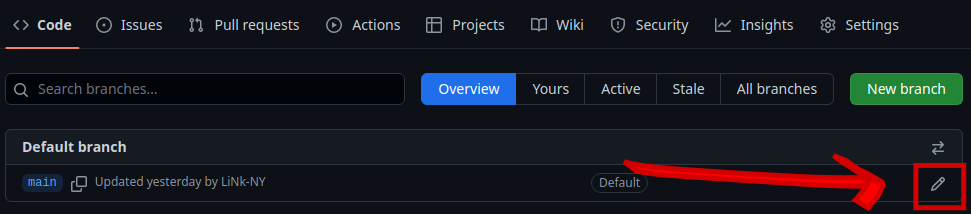

# Branch Rename FAQs

The _Bioconductor_ project has chosen 'devel' to be the default branch for
GitHub and git repositories. To prepare for this transition, we have compiled a
list of Frequently Asked Questions (FAQs) below with instructions on how
to rename the default branch both on local clones and on GitHub.

## What is changing?

The Bioconductor core team will __only__ rename the default branch to 'devel' on
the Bioconductor git repository at `git.bioconductor.org`. All other
repository clones including those on hosting platforms such as GitHub, GitLabs,
etc. will not be _directly_ affected by the core team's change; however, we
highly recommend that maintainers and developers update their local and cloud
repository clones to match the default branch name.

## Who is affected by this change?

Bioconductor developers and maintainers are affected by this change.
Bioconductor users are not affected.

## What repositories are affected by this change?

Note that there may exist several clones of a single repository, e.g., on
different servers and workstations. **Only** the repository that resides in the
Bioconductor server hosted at `git.bioconductor.org` will be affected. The
default branch for all packages in the Bioconductor git server
will be set to `devel`. Maintainers and collaborators will be responsible for
updating local and cloud repository clones.

We recommend synchronizing the default branch changes to the GitHub-hosted
repository to simplify workflows.

For typical setup scenarios, see the [tidyverse blog
post](https://www.tidyverse.org/blog/2021/10/renaming-default-branch/).

## What do I need to change?

We recommend Bioconductor developers to rename default branches on their
__local__ repositories to 'devel'. Optionally (and highly encouraged), GitHub
and other local copies of affected repositories, including those from
collaborators, should have their branches renamed.

Bioconductor users will not need to do anything.

**Note**. The minority of maintainers _without_ a GitHub repository should
rename and set the 'HEAD' as follows:

    git branch -m master devel
    git fetch origin
    git branch -u origin/devel devel
    git remote set-head origin -a

All other maintainers with GitHub repositories should see the sections [How do
I set 'devel' as the default branch on
GitHub?](#how-do-i-set-devel-as-the-default-branch-on-github) and [How do I set
'devel' as the default local
'branch?](#how-do-i-set-devel-as-the-default-local-branch), respectively.

## What if I am an RStudio user?

Maintainers that use RStudio should be familiar with running `git` commands
via the `Terminal` tab in RStudio. The commands shown in this documentation
can be entered in the `Terminal` tab, e.g., `git fetch --all` to obtain all
updates from available remotes.

## What if I create a fresh clone of my repository?

It is possible to create a fresh clone of the repository but you may lose
any working changes in the old local repository. This should only be done if
you are comfortable with `git` and would like to start afresh. You will also
need to set up the git remotes as
[below](#what-should-my-git-remotes-look-like).

## What should my Git remotes look like?

As a reminder, maintainers who use GitHub should have the following recommended
setup. The command `git remote -v` should display an `origin` remote that points
to the GitHub location and an `upstream` remote that points to the Bioconductor
git repository. For example, this is the set up for `BiocGenerics`:

    git remote -v
    # origin	git@github.com:Bioconductor/BiocGenerics (fetch)
    # origin	git@github.com:Bioconductor/BiocGenerics (push)
    # upstream	git@git.bioconductor.org:packages/BiocGenerics (fetch)
    # upstream	git@git.bioconductor.org:packages/BiocGenerics (push)
    
__Note__. As maintainers, we use the SSH protocol for both remotes.

## How do I sync my Git remotes?

Before making updates to local branches, make sure that both remotes `origin`
and `upstream` are in sync with:

    git checkout master
    git pull origin master
    git pull upstream devel:master
    
__Note__. These commands are to be run on the old local repository and do not
apply to freshly cloned repositories.

## How do I set 'devel' as the default branch on GitHub?

For maintainers who manage GitHub repositories and would like to use streamlined
commands, we recommend synchronizing the default branch changes to their GitHub
repositories. To this end, GitHub has provided a convenient way to rename the
default branch of any repository. First, go to
`https://github.com/{username}/{repo}/branches` where
`username` and `repo` correspond to your GitHub username and repository,
respectively.

Then, click on the 'edit' pencil `r emo::ji("pen")` to rename the branch (seen
here at the bottom right corner) and rename the branch to 'devel':

```{r,echo=FALSE,out.width = "100%"}

```

That's it! The default branch on GitHub is now set to `devel`.

Follow the instructions in the [How do I set 'devel' as the default local
branch?](#how-do-i-set-devel-as-the-default-local-branch) to sync local
repository clones.

## What if I already have a 'devel' branch on GitHub?

Simply select the "switch default branch" button (which looks like exchange
arrows `r emo::ji("arrows_counterclockwise")`) at the top right of the "Default
branch" box when navigating to `https://github.com/{username}/{repo}/branches`
where `username` and `repo` correspond to your GitHub username and repository,
respectively.

## How do I set 'devel' as the default local branch?

In order to keep commands simple and avoid confusion, we recommend making the
same default branch changes to the GitHub repository. This allows minimal
commands such as

    git push origin
    git push upstream

to simply work without specifying additional parameters, (e.g., `main:devel`)
when pushing to GitHub and Bioconductor.

For maintainers who wish to make changes on GitHub as well, we recommend
performing the rename operation on
[GitHub _first_](#how-do-i-set-devel-as-the-default-branch-on-github), then
performing an adjustment (rename) of the local branch(es).

__Note__. This step is not necessary if you cloned a fresh copy from the
Bioconductor git server though you will have to re-specify the `origin` and
`upstream` remotes (as described [above](#what-should-my-git-remotes-look-like))
with a fresh copy.

Once the branch is renamed on GitHub, use the GitHub-provided commands to update
the local copy of the repository:

    git branch -m master devel
    git fetch origin
    git branch -u origin/devel devel
    git remote set-head origin -a

__Note__. Change 'master' to 'main' if the repository has 'main' as the default
branch:

    git branch -m main devel
    git fetch origin
    git branch -u origin/devel devel
    git remote set-head origin -a

## How do I push to Bioconductor after renaming?

To push `upstream` to Bioconductor, the developer will simply push to the
`devel` branch: 

    ## branch should already exist
    git checkout devel
    #### <commit changes and bump version etc.>
    git push upstream devel

## Clean up: How do I get rid of stale remote-tracking branches?

After the rename, there will remain stale references in the `origin` remote.
See all the local and remote branches with `git branch -a`:

    git branch -a
    # * devel
    # remotes/origin/HEAD -> origin/devel
    # [...]
    # remotes/origin/master

Run the following to get rid of the stale reference to "master" in the `origin`
remote:

    git remote prune origin --dry-run

**Note**. Remove the `--dry-run` option after making sure that the correct
remote reference is listed.

## What if I have a GitLab repository?

It is possible to also change the default branch on GitLab. See the
[change default branch instructions](https://docs.gitlab.com/ee/user/project/repository/branches/default.html#change-the-default-branch-name-for-a-project).
Once complete, you can update the local repository similarly to the [above
instructions](#how-do-i-set-devel-as-the-default-local-branch).
